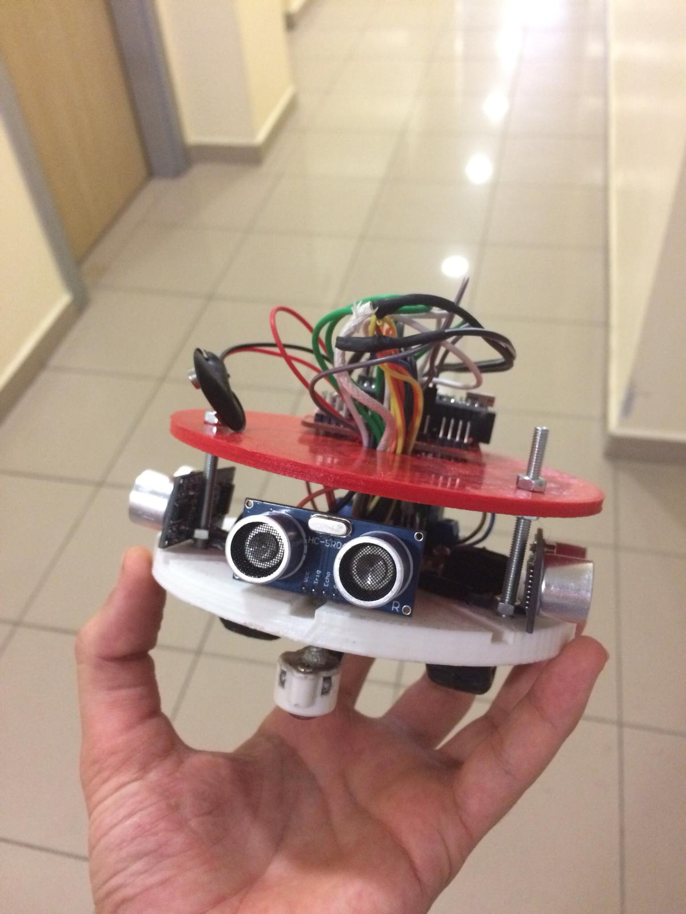

# Labirent Cozen Robot

Bu projede; Ultrasonik mesafe sensöründen aldığı verileri işleyip rastgele bir yol atayarak gider. Çözmez, sadece tahmin ederek yolunu bulur. Robot yarışmaların kategorisinde kullanılan daha öncede yarışmış robottur. (Sormayın. Hayır kazanamadık.)

# UYARI!
Sensörlerden aldığı veriler bozuk, yanlış vb. olması durumunda robotun hareketleri saçmalamaya başlar.
# UYARI BİTTİ.
-------------------------------------------------------------------------------------------------------------

>Bu projede labirent çözen robot yapımını gösterdim. Fotoğrafı Aşağıdadır. 
>Bağlantıları hazırladığım şekilde yaptığınızda pek bir sorun çıkacağını sanmam. 
>Eğer sorun çıkarsa lütfen iletişime geçin.

### Herkese İyi Çalışmalar :)
